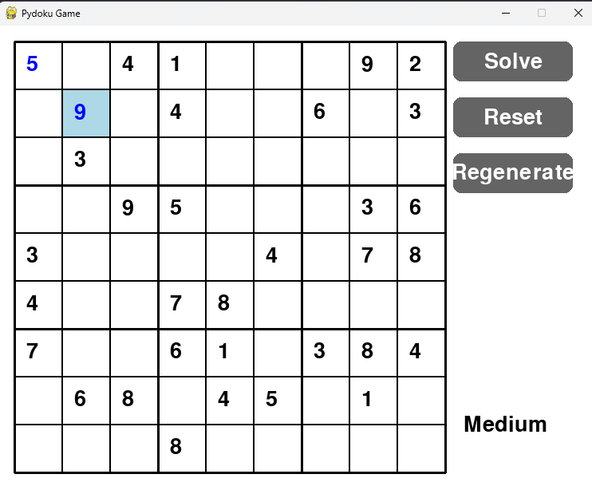

# Pydoku

[](LICENSE)
[](https://www.python.org/)
[](https://python-poetry.org/)
[](https://www.python.org/downloads/release/python-370/)
[](https://www.pygame.org/)
[](https://github.com/tristanqtn/pydoku)

```
 _______  __   __  ______   _______  ___   _  __   __
|       ||  | |  ||      | |       ||   | | ||  | |  |
|    _  ||  |_|  ||  _    ||   _   ||   |_| ||  | |  |
|   |_| ||       || | |   ||  | |  ||      _||  |_|  |
|    ___||_     _|| |_|   ||  |_|  ||     |_ |       |
|   |      |   |  |       ||       ||    _  ||       |
|___|      |___|  |______| |_______||___| |_||_______|
```

This is a Sudoku game implemented in Python using the Pygame library. It allows you to play Sudoku interactively in a graphical user interface (GUI).



## Features

- **Interactive Sudoku Grid:** Play Sudoku with an interactive grid where you can click on cells to enter numbers.
- **Solver:** Option to automatically solve the Sudoku puzzle using a backtracking algorithm.
- **Reset and Regenerate:** Reset the current game or generate a new Sudoku puzzle.
- **Difficulty Level:** Displays the difficulty level of the current puzzle.
- **Visual Feedback:** Highlights the selected cell and changes grid color on successful completion.

## Installation

1. Clone the repository:

   ```bash
   git clone https://github.com/tristanqtn/pydoku.git
   ```

2. Navigate into the project directory:

   ```bash
   cd pydoku
   ```

3. Install dependencies using Poetry:

   ```bash
   poetry install
   ```

## Usage

Activate the Poetry virtual environment:

```bash
poetry shell
```

Run the Sudoku game:

```bash
python .\pydoku.py
```

## Controls

- **Mouse Click:** Select a cell in the Sudoku grid.
- **Keyboard Input:**

  - Enter numbers (1-9) to fill selected cells.
  - Use Backspace to clear a cell.
  - Press Enter to solve the Sudoku puzzle.

- **Buttons:**
  - **Solve:** Automatically solve the Sudoku puzzle.
  - **Reset:** Clear the current puzzle and start over.
  - **Regenerate:** Generate a new Sudoku puzzle.

## Credits

- **Pygame:** Used for the graphical interface.
- **Requests:** Used for API requests to fetch Sudoku puzzles.
- **Poetry:** Package manager for managing dependencies.

## License

This project is licensed under the MIT License - see the [LICENSE](LICENSE) file for details.
